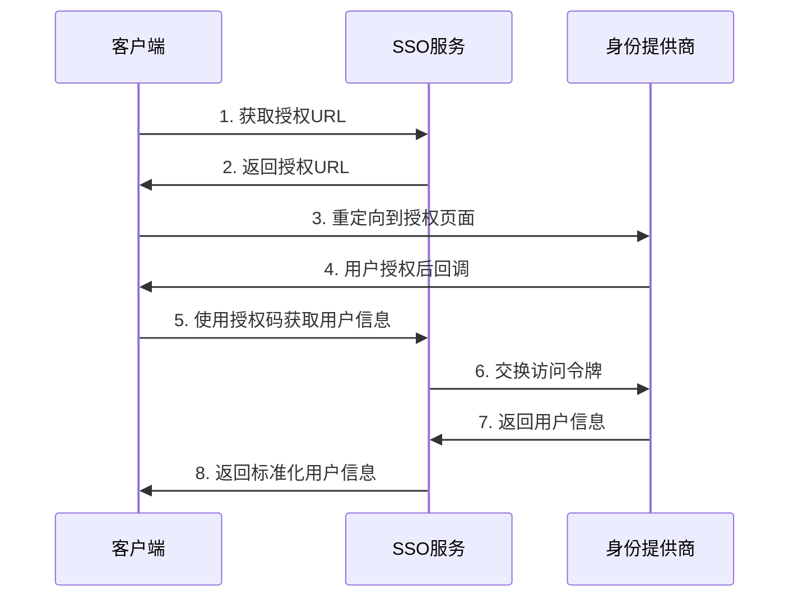

# FastGPT SSO API接口文档

## 概述

FastGPT SSO 提供了完整的单点登录API接口，支持OAuth2.0和SAML2.0认证协议，以及用户和组织管理功能。

## 基础信息

- **Base URL**: `http://localhost:3000` (开发环境)
- **Content-Type**: `application/json`
- **认证方式**: Bearer Token (部分接口需要，通过 `AUTH_TOKEN` 环境变量配置)

## 认证流程

### OAuth2.0 认证流程



## API接口详情

### 1. 认证相关接口

#### 1.1 获取OAuth授权URL

**接口地址**: `GET /auth/url`

**功能描述**: 生成OAuth2.0授权URL，用户通过此URL进行身份认证。

**请求参数**:

| 参数名 | 类型 | 必填 | 描述 |
|--------|------|------|------|
| redirect_uri | string | 是 | 授权成功后的回调URL |
| state | string | 否 | 状态参数，用于防止CSRF攻击 |

**请求示例**:
```http
GET /login/oauth/getAuthURL?redirect_uri=https://app.example.com/callback&state=random_string
```

**响应格式**:
```json
{
  "success": true,
  "message": "",
  "authURL": "https://auth.provider.com/oauth/authorize?client_id=xxx&redirect_uri=xxx&response_type=code&state=xxx"
}
```

**错误响应**:
```json
{
  "error": "redirect_uri is required"
}
```

#### 1.2 OAuth回调处理

**接口地址**: `GET /oauth/callback`

**功能描述**: 处理OAuth提供商的回调请求，完成认证流程。

**请求参数**:

| 参数名 | 类型 | 必填 | 描述 |
|--------|------|------|------|
| code | string | 是 | 授权码 |
| state | string | 否 | 状态参数 |

**响应**: 重定向到指定的回调URL

#### 1.3 获取用户信息

**接口地址**: `GET /user/info`

**功能描述**: 通过授权码获取用户详细信息。

**请求参数**:

| 参数名 | 类型 | 必填 | 描述 |
|--------|------|------|------|
| code | string | 是 | OAuth授权码 |

**请求示例**:
```http
GET /login/oauth/getUserInfo?code=authorization_code_here
```

**响应格式**:
```json
{
  "success": true,
  "message": "",
  "username": "user123",
  "avatar": "https://avatar.example.com/user123.jpg",
  "memberName": "张三",
  "contact": "zhangsan@example.com"
}
```

**错误响应**:
```json
{
  "success": false,
  "message": "Invalid authorization code"
}
```

### 2. SAML2.0 相关接口

#### 2.1 获取SAML元数据

**接口地址**: `GET /saml/metadata`

**功能描述**: 返回SAML2.0服务提供商的元数据XML。

**响应格式**: XML格式的SAML元数据

**Content-Type**: `application/xml`

#### 2.2 SAML断言处理

**接口地址**: `POST /saml/assert`

**功能描述**: 处理身份提供商发送的SAML断言。

**请求参数**:

| 参数名 | 类型 | 必填 | 描述 |
|--------|------|------|------|
| SAMLResponse | string | 是 | Base64编码的SAML响应 |
| RelayState | string | 否 | 中继状态 |

**响应**: 重定向到指定的回调URL

### 3. 用户管理接口

#### 3.1 获取用户列表

**接口地址**: `GET /user/list`

**功能描述**: 获取当前身份提供商的用户列表。

**认证要求**: 需要Bearer Token

**请求头**:
```http
Authorization: Bearer your_access_token
```

**响应格式**:
```json
{
  "success": true,
  "message": "",
  "userList": [
    {
      "username": "LCFC-123456789",
      "memberName": "张三",
      "avatar": "",
      "contact": "13800138000",
      "orgs": ["DEPT001"]
    },
    {
      "username": "user456",
      "memberName": "李四",
      "avatar": "https://avatar.example.com/user456.jpg",
      "contact": "lisi@example.com",
      "orgs": ["DEPT002"]
    }
  ]
}
```

#### 3.2 获取组织列表

**接口地址**: `GET /org/list`

**功能描述**: 获取组织架构列表。

**认证要求**: 需要Bearer Token

**请求头**:
```http
Authorization: Bearer your_access_token
```

**响应格式**:
```json
{
  "success": true,
  "message": "",
  "orgList": [
    {
      "id": "DEPT001",
      "name": "技术部",
      "parentId": "ROOT"
    },
    {
      "id": "DEPT002",
      "name": "产品部",
      "parentId": "ROOT"
    }
  ]
}
```

#### 3.3 获取全量用户数据

**接口地址**: `GET /user/all/list`

**功能描述**: 从数据库获取所有用户数据，包括常规用户和增量用户。

**认证要求**: 无

**响应格式**:
```json
{
  "code": 1000,
  "msg": "用户列表获取成功",
  "data": [
    {
      "name": "张三",
      "acctName": "张三",
      "key": "123456789",
      "status": "在职",
      "isPublic": "1",
      "isPartners": "0",
      "period": "长期有效",
      "createTime": "2024-01-15",
      "disableTime": ""
    }
  ]
}
```

**字段说明**:

| 字段名 | 类型 | 描述 |
|--------|------|------|
| name | string | 用户姓名 |
| acctName | string | 账户名称 |
| key | string | 用户唯一标识 |
| status | string | 用户状态（在职/离职） |
| isPublic | string | 是否公开用户（1=是，0=否） |
| isPartners | string | 是否合作伙伴（1=是，0=否） |
| period | string | 账户有效期 |
| createTime | string | 创建时间 |
| disableTime | string | 禁用时间 |

#### 3.4 增量用户数据接口

**接口地址**: `POST /user/incremental`

**功能描述**: 接收外部系统推送的增量用户数据，支持用户的创建和删除。

**Content-Type**: `application/json`

**请求体**:
```json
{
  "name": "王五",
  "acctName": "wangwu",
  "key": "EMP001",
  "deptCode": "DEPT003",
  "email": "wangwu@example.com",
  "userName": "wangwu",
  "accountType": "employee",
  "domainAccount": "domain\\wangwu",
  "employeeNumber": "EMP001",
  "mobile": "13900139000",
  "company": "示例公司",
  "sex": "男",
  "isquit": "0"
}
```

**请求参数说明**:

| 参数名 | 类型 | 必填 | 描述 |
|--------|------|------|------|
| name | string | 是 | 用户姓名 |
| userName | string | 是 | 用户名（唯一标识） |
| email | string | 否 | 邮箱地址 |
| mobile | string | 否 | 手机号码 |
| deptCode | string | 否 | 部门代码 |
| isquit | string | 是 | 是否离职（0=在职，1=离职） |
| acctName | string | 否 | 账户名称 |
| key | string | 否 | 员工编号 |
| accountType | string | 否 | 账户类型 |
| domainAccount | string | 否 | 域账户 |
| employeeNumber | string | 否 | 员工号 |
| company | string | 否 | 公司名称 |
| sex | string | 否 | 性别 |

**响应格式**:
```json
{
  "code": 1000,
  "msg": "增量用户记录添加成功"
}
```

**业务逻辑**:
- 当 `isquit` = "0" 时，创建或更新用户信息
- 当 `isquit` = "1" 时，删除用户信息
- 用户名 `userName` 作为唯一标识，不允许重复

**错误响应**:
```json
{
  "code": 4000,
  "msg": "请求体不能为空"
}
```

```json
{
  "code": 5000,
  "msg": "服务器内部错误",
  "error": "具体错误信息"
}
```

### 4. 系统接口

#### 4.1 健康检查

**接口地址**: `GET /test`

**功能描述**: 检查服务是否正常运行。

**响应**: `FastGPT-SSO-Service`

## 错误码说明

### HTTP状态码

| 状态码 | 说明 |
|--------|------|
| 200 | 请求成功 |
| 400 | 请求参数错误 |
| 401 | 未授权访问 |
| 403 | 禁止访问 |
| 404 | 资源不存在 |
| 500 | 服务器内部错误 |

### 业务错误码

| 错误码 | 说明 |
|--------|------|
| 1000 | 操作成功 |
| 4000 | 请求参数错误 |
| 4001 | 用户不存在 |
| 4002 | 用户已存在 |
| 5000 | 服务器内部错误 |
| 5001 | 数据库连接错误 |
| 5002 | 外部API调用失败 |

## 认证和授权

### Bearer Token认证

部分接口需要在请求头中携带访问令牌：

```http
Authorization: Bearer your_access_token
```

### 获取访问令牌

访问令牌通过OAuth2.0流程获取，具体步骤：

1. 调用 `/login/oauth/getAuthURL` 获取授权URL
2. 用户在授权页面完成认证
3. 系统通过回调获取授权码
4. 使用授权码调用 `/login/oauth/getUserInfo` 获取用户信息和令牌

## 请求示例

### cURL示例

#### 获取授权URL
```bash
curl -X GET "http://localhost:3000/login/oauth/getAuthURL?redirect_uri=https://app.example.com/callback&state=random123"
```

#### 获取用户信息
```bash
curl -X GET "http://localhost:3000/login/oauth/getUserInfo?code=auth_code_here"
```

#### 获取用户列表
```bash
curl -X GET "http://localhost:3000/user/list" \
  -H "Authorization: Bearer your_access_token"
```

#### 添加增量用户
```bash
curl -X POST "http://localhost:3000/user/incremental" \
  -H "Content-Type: application/json" \
  -d '{
    "name": "测试用户",
    "userName": "testuser",
    "email": "test@example.com",
    "mobile": "13800138000",
    "deptCode": "DEPT001",
    "isquit": "0"
  }'
```

### JavaScript示例

#### 获取授权URL
```javascript
const response = await fetch('/login/oauth/getAuthURL?' + new URLSearchParams({
  redirect_uri: 'https://app.example.com/callback',
  state: 'random123'
}));

const data = await response.json();
if (data.success) {
  window.location.href = data.authURL;
}
```

#### 获取用户信息
```javascript
const response = await fetch(`/login/oauth/getUserInfo?code=${authCode}`);
const userInfo = await response.json();

if (userInfo.success) {
  console.log('用户信息:', userInfo);
}
```

#### 添加增量用户
```javascript
const userData = {
  name: '测试用户',
  userName: 'testuser',
  email: 'test@example.com',
  mobile: '13800138000',
  deptCode: 'DEPT001',
  isquit: '0'
};

const response = await fetch('/user/incremental', {
  method: 'POST',
  headers: {
    'Content-Type': 'application/json'
  },
  body: JSON.stringify(userData)
});

const result = await response.json();
console.log('添加结果:', result);
```

## 数据格式说明

### 用户数据格式

#### 标准用户格式 (UserListType)
```typescript
{
  username: string;      // 用户名
  memberName: string;    // 显示名称
  avatar?: string;       // 头像URL（可选）
  contact?: string;      // 联系方式（可选）
  orgs?: string[];       // 所属组织列表（可选）
}
```

#### LCFC用户格式 (lcfcUser)
```typescript
{
  name: string;          // 用户姓名
  acctName: string;      // 账户名称
  key: string;           // 用户标识
  status: string;        // 用户状态
  isPublic: string;      // 是否公开
  isPartners: string;    // 是否合作伙伴
  period: string;        // 有效期
  createTime: string;    // 创建时间
  disableTime: string;   // 禁用时间
}
```

### 组织数据格式

```typescript
{
  id: string;            // 组织ID
  name: string;          // 组织名称
  parentId: string;      // 父组织ID
}
```

## 集成指南

### 前端集成

1. **初始化认证流程**
   ```javascript
   // 获取授权URL并重定向
   const authResponse = await fetch('/login/oauth/getAuthURL?' + params);
   const { authURL } = await authResponse.json();
   window.location.href = authURL;
   ```

2. **处理回调**
   ```javascript
   // 从URL参数中获取授权码
   const urlParams = new URLSearchParams(window.location.search);
   const code = urlParams.get('code');
   
   // 获取用户信息
   const userResponse = await fetch(`/login/oauth/getUserInfo?code=${code}`);
   const userInfo = await userResponse.json();
   ```

### 后端集成

1. **验证访问令牌**
   ```javascript
   // 中间件验证Token
   const token = req.headers.authorization?.replace('Bearer ', '');
   // 验证token有效性
   ```

2. **调用用户管理API**
   ```javascript
   // 获取用户列表
   const response = await fetch('/user/list', {
     headers: {
       'Authorization': `Bearer ${token}`
     }
   });
   ```

## 常见问题

### Q: 如何处理Token过期？
A: 当API返回401状态码时，需要重新进行OAuth认证流程获取新的Token。

### Q: 增量用户接口支持批量操作吗？
A: 当前版本只支持单个用户操作，如需批量操作请多次调用接口。

### Q: 如何区分增量用户和常规用户？
A: 在lcfcUser格式中，增量用户的`isPublic`为"0"，`isPartners`为"1"；常规用户相反。

### Q: SAML和OAuth可以同时使用吗？
A: 可以，系统支持多种认证协议，通过不同的端点访问。

### Q: 如何自定义字段映射？
A: 通过环境变量配置字段映射，如`OAUTH2_USERNAME_MAP`等。

---

本API文档将随着系统更新持续维护，如有疑问请联系开发团队。