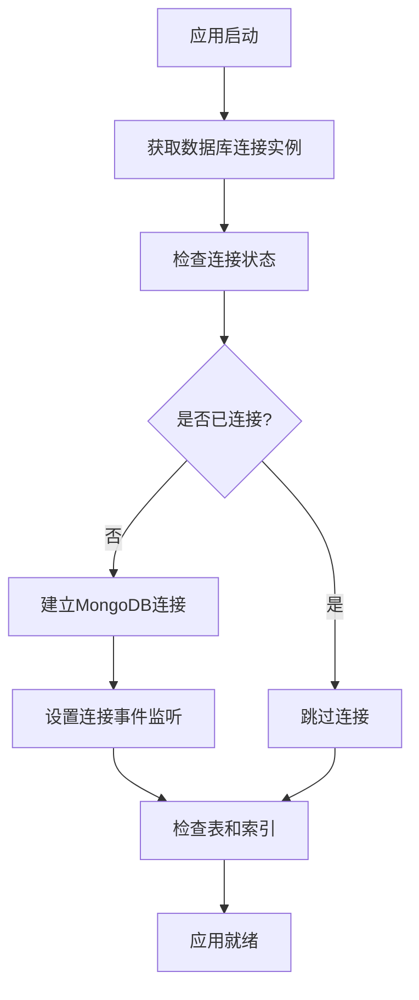

# FastGPT SSO 数据库设计文档

## 概述

FastGPT SSO 系统使用 MongoDB 作为主要数据库，采用文档型数据库的灵活性来存储用户和组织信息。系统设计支持与现有 FastGPT 数据库的集成，同时提供独立的增量用户管理功能。

## MongoDB 数据库架构

### 连接配置

系统使用 MongoDB 作为主要数据存储，通过 Mongoose ODM 进行数据操作。连接配置通过环境变量进行管理：

```javascript
// 环境变量配置
MONGODB_URI=mongodb://localhost:27017/fastgpt-sso
```

```javascript
// 连接参数
{
  maxPoolSize: 10,                    // 最大连接池大小
  serverSelectionTimeoutMS: 5000,     // 服务器选择超时时间
  socketTimeoutMS: 45000,             // Socket超时时间
  bufferCommands: false               // 禁用命令缓冲
}
```

### 连接管理

`DatabaseConnection` 类负责管理 MongoDB 连接的生命周期：

```typescript
class DatabaseConnection {
  private static isConnected: boolean = false;
  
  // 连接数据库
  static async connect(): Promise<void>
  
  // 断开连接
  static async disconnect(): Promise<void>
  
  // 检查连接状态
  static isConnectionReady(): boolean
}
```

## 数据模型设计

### 1. 增量用户模型 (incremental_users)

#### 集合名称
`incremental_users`

#### 数据结构

```typescript
// 增量用户数据接口
export interface IncrementalUserData {
  username: string;
  memberName: string;
  avatar: string;
  contact: string;
  orgs: Array<string>;
}

export interface IIncrementalUser extends Document {
  username: string;           // 用户名（唯一标识）
  memberName: string;         // 用户显示名称
  avatar: string;             // 头像URL
  contact: string;            // 联系方式（邮箱或手机）
  orgs: Array<string>;        // 所属组织列表
  createdAt: Date;            // 创建时间（自动生成）
  updatedAt: Date;            // 更新时间（自动生成）
}
```

#### Schema定义

```typescript
const IncrementalUserSchema: Schema = new Schema(
  {
    username: {
      type: String,
      required: true,
      unique: true,
      index: true
    },
    memberName: {
      type: String,
      required: true
    },
    avatar: {
      type: String,
      required: true
    },
    contact: {
      type: String,
      required: true
    },
    orgs: {
      type: [String],
      required: true,
      default: []
    }
  },
  {
    timestamps: true,
    collection: 'incremental_users'
  }
);
```

#### 索引设计

```javascript
// 主要索引
IncrementalUserSchema.index({ username: 1 });     // 唯一索引
IncrementalUserSchema.index({ memberName: 1 });   // 查询索引

// 复合索引（根据需要添加）
IncrementalUserSchema.index({ username: 1, createdAt: -1 });
IncrementalUserSchema.index({ orgs: 1 });
```

#### 字段说明

| 字段名 | 类型 | 必填 | 唯一 | 索引 | 描述 |
|--------|------|------|------|------|------|
| _id | ObjectId | 是 | 是 | 是 | MongoDB主键 |
| username | String | 是 | 是 | 是 | 用户名，系统唯一标识 |
| memberName | String | 是 | 否 | 是 | 用户显示名称 |
| avatar | String | 是 | 否 | 否 | 头像URL地址 |
| contact | String | 是 | 否 | 否 | 联系方式 |
| orgs | Array<String> | 是 | 否 | 是 | 所属组织代码列表 |
| createdAt | Date | 是 | 否 | 否 | 记录创建时间 |
| updatedAt | Date | 是 | 否 | 否 | 记录更新时间 |

#### 数据示例

```json
{
  "_id": "507f1f77bcf86cd799439011",
  "username": "zhangsan",
  "memberName": "张三",
  "avatar": "https://avatar.example.com/zhangsan.jpg",
  "contact": "zhangsan@example.com",
  "orgs": ["DEPT001", "PROJ001"],
  "createdAt": "2024-01-15T08:30:00.000Z",
  "updatedAt": "2024-01-15T08:30:00.000Z"
}
```

### 2. FastGPT 现有数据模型集成

系统需要与 FastGPT 现有的数据库集成，主要涉及以下集合：

#### 2.1 用户集合 (users)

```typescript
interface FastGPTUser {
  _id: ObjectId;
  username: string;
  email?: string;
  avatar?: string;
  status: 'active' | 'inactive';
  createTime: Date;
  // 其他FastGPT用户字段
}
```

#### 2.2 团队集合 (teams)

```typescript
interface FastGPTTeam {
  _id: ObjectId;
  name: string;
  description?: string;
  createTime: Date;
  // 其他FastGPT团队字段
}
```

#### 2.3 团队成员集合 (team_members)

```typescript
interface FastGPTTeamMember {
  _id: ObjectId;
  userId: ObjectId;        // 关联users集合
  teamId: ObjectId;        // 关联teams集合
  role: string;
  status: string;
  createTime: Date;
  // 其他字段
}
```

## 数据访问层设计

### 1. 数据库连接管理

#### 连接初始化流程



#### 连接事件处理

```javascript
// 连接成功
mongoose.connection.on('connected', () => {
  console.log('MongoDB连接成功');
});

// 连接错误
mongoose.connection.on('error', (error) => {
  console.error('MongoDB连接错误:', error);
  this.isConnected = false;
});

// 连接断开
mongoose.connection.on('disconnected', () => {
  console.log('MongoDB连接断开');
  this.isConnected = false;
});
```

### 2. 数据访问服务

#### 2.1 增量用户服务 (IncrementalUserService)

```typescript
export class IncrementalUserService {
  // 检查用户是否存在
  static async checkUserExists(userName: string): Promise<boolean>
  
  // 添加增量用户（仅在不存在时创建）
  static async addIncrementalUser(userData: IncrementalUserData): Promise<IIncrementalUser>
  
  // 更新用户信息
  static async updateUser(userName: string, userData: Partial<IncrementalUserData>): Promise<IIncrementalUser | null>
  
  // 删除用户
  static async deleteUser(userName: string): Promise<boolean>
}
```

#### 2.2 FastGPT用户服务 (FastGPTUserService)

```typescript
export class FastGPTUserService {
  // 获取用户列表（通过provider）
  static async getUserList(): Promise<lcfcUser[]>
  
  // 获取增量用户数据
  static async getIncrementalUsers(): Promise<lcfcUser[]>
  
  // 获取非增量用户数据
  static async getNonIncrementalUsers(): Promise<lcfcUser[]>
  
  // 获取所有用户数据
  static async getAllUsers(): Promise<lcfcUser[]>
  
  // 数据转换方法
  private static convertToLcfcUser(user: any): lcfcUser
}
```

## 查询优化策略

### 1. 索引策略

#### 单字段索引
```javascript
// 用户名唯一索引（最重要）
{ username: 1 }

// 显示名称查询索引
{ memberName: 1 }

// 组织查询索引
{ orgs: 1 }
```

#### 复合索引
```javascript
// 用户名 + 创建时间（分页查询）
{ username: 1, createdAt: -1 }

// 组织 + 创建时间（组织内用户查询）
{ orgs: 1, createdAt: -1 }

// 状态 + 更新时间（状态变更查询）
{ status: 1, updatedAt: -1 }
```

### 2. 查询性能优化

#### 分页查询
```javascript
// 使用skip和limit进行分页
const users = await IncrementalUser
  .find(query)
  .sort({ createdAt: -1 })
  .skip((page - 1) * pageSize)
  .limit(pageSize)
  .lean(); // 使用lean()提高性能
```

#### 聚合查询优化
```javascript
// FastGPT用户数据聚合查询
const pipeline = [
  {
    $lookup: {
      from: 'users',
      localField: 'userId',
      foreignField: '_id',
      as: 'userInfo'
    }
  },
  {
    $lookup: {
      from: 'teams',
      localField: 'teamId',
      foreignField: '_id',
      as: 'teamInfo'
    }
  },
  {
    $match: {
      'userInfo.status': 'active'
    }
  },
  {
    $project: {
      // 只选择需要的字段
      'userInfo.username': 1,
      'userInfo.avatar': 1,
      'teamInfo.name': 1
    }
  }
];
```

## 数据一致性保证

### 1. 事务处理

```javascript
// 使用MongoDB事务确保数据一致性
const session = await mongoose.startSession();

try {
  await session.withTransaction(async () => {
    // 在事务中执行多个操作
    await IncrementalUser.create([userData], { session });
    await AuditLog.create([logData], { session });
  });
} finally {
  await session.endSession();
}
```

### 2. 数据验证

#### Schema级别验证
```javascript
const IncrementalUserSchema = new Schema({
  username: {
    type: String,
    required: [true, '用户名不能为空'],
    unique: true,
    minlength: [3, '用户名至少3个字符'],
    maxlength: [50, '用户名不能超过50个字符'],
    match: [/^[a-zA-Z0-9_-]+$/, '用户名只能包含字母、数字、下划线和连字符']
  },
  memberName: {
    type: String,
    required: [true, '显示名称不能为空'],
    maxlength: [100, '显示名称不能超过100个字符']
  },
  contact: {
    type: String,
    required: [true, '联系方式不能为空'],
    validate: {
      validator: function(v) {
        // 验证邮箱或手机号格式
        const emailRegex = /^[^\s@]+@[^\s@]+\.[^\s@]+$/;
        const phoneRegex = /^1[3-9]\d{9}$/;
        return emailRegex.test(v) || phoneRegex.test(v);
      },
      message: '联系方式必须是有效的邮箱或手机号'
    }
  }
});
```

#### 应用级别验证
```javascript
class IncrementalUserService {
  static async addIncrementalUser(userData: IncrementalUserData) {
    // 检查用户是否已存在
    const exists = await this.checkUserExists(userData.username);
    if (exists) {
      throw new Error(`用户 ${userData.username} 已存在`);
    }
    
    // 验证组织代码有效性
    await this.validateOrgCodes(userData.orgs);
    
    // 创建用户
    return await IncrementalUser.create(userData);
  }
}
```

## 数据迁移和维护

### 1. 数据库初始化

```javascript
export async function initializeDatabase(): Promise<void> {
  try {
    // 1. 建立数据库连接
    await DatabaseConnection.connect();
    
    // 2. 检查并创建必要的集合
    await ensureTablesAndIndexes();
    
    // 3. 创建索引
    await createIndexes();
    
    console.log('数据库初始化完成');
  } catch (error) {
    console.error('数据库初始化失败:', error);
    throw error;
  }
}
```

### 2. 索引管理

```javascript
export async function createIndexes(): Promise<void> {
  const IncrementalUser = await import('./model/incrementalUser');
  
  // 创建所有定义的索引
  await IncrementalUser.default.createIndexes();
  
  // 检查索引状态
  const indexes = await IncrementalUser.default.collection.getIndexes();
  console.log('当前索引:', indexes);
}
```

### 3. 数据备份策略

#### 定期备份
```bash
# MongoDB备份命令
mongodump --host localhost:27017 --db fastgpt_sso --out /backup/$(date +%Y%m%d)

# 恢复命令
mongorestore --host localhost:27017 --db fastgpt_sso /backup/20240115/fastgpt_sso
```

#### 增量备份
```javascript
// 基于时间戳的增量备份
const lastBackupTime = await getLastBackupTime();
const incrementalData = await IncrementalUser.find({
  updatedAt: { $gt: lastBackupTime }
});

// 导出增量数据
fs.writeFileSync(
  `backup/incremental_${Date.now()}.json`,
  JSON.stringify(incrementalData, null, 2)
);
```

## 性能监控

### 1. 查询性能监控

```javascript
// 启用MongoDB慢查询日志
db.setProfilingLevel(1, { slowms: 100 });

// 查看慢查询
db.system.profile.find().sort({ ts: -1 }).limit(5);
```

### 2. 连接池监控

```javascript
// 监控连接池状态
mongoose.connection.on('connected', () => {
  const db = mongoose.connection.db;
  setInterval(() => {
    const stats = db.serverStatus();
    console.log('连接数:', stats.connections);
    console.log('活跃连接:', stats.connections.active);
  }, 60000); // 每分钟检查一次
});
```

### 3. 数据库统计信息

```javascript
// 获取集合统计信息
const stats = await IncrementalUser.collection.stats();
console.log('文档数量:', stats.count);
console.log('平均文档大小:', stats.avgObjSize);
console.log('索引大小:', stats.totalIndexSize);
```

## 安全考虑

### 1. 数据加密

```javascript
// 敏感字段加密
const crypto = require('crypto');

const encryptSensitiveData = (data) => {
  const cipher = crypto.createCipher('aes-256-cbc', process.env.ENCRYPT_KEY);
  let encrypted = cipher.update(data, 'utf8', 'hex');
  encrypted += cipher.final('hex');
  return encrypted;
};
```

### 2. 访问控制

```javascript
// MongoDB用户权限配置
db.createUser({
  user: "sso_app",
  pwd: "secure_password",
  roles: [
    {
      role: "readWrite",
      db: "fastgpt_sso"
    }
  ]
});
```

### 3. 审计日志

```javascript
// 数据变更审计
IncrementalUserSchema.post('save', function(doc) {
  AuditLog.create({
    action: 'CREATE',
    collection: 'incremental_users',
    documentId: doc._id,
    userId: this.currentUser,
    timestamp: new Date(),
    changes: doc.toObject()
  });
});
```

## 故障排除

### 1. 常见问题

#### 连接超时
```javascript
// 增加连接超时时间
mongoose.connect(mongoUri, {
  serverSelectionTimeoutMS: 10000, // 增加到10秒
  socketTimeoutMS: 60000           // 增加到60秒
});
```

#### 索引冲突
```javascript
// 删除冲突的索引
db.incremental_users.dropIndex("username_1");

// 重新创建索引
db.incremental_users.createIndex({ "username": 1 }, { "unique": true });
```

### 2. 性能问题诊断

```javascript
// 分析查询执行计划
const explain = await IncrementalUser
  .find({ username: 'test' })
  .explain('executionStats');

console.log('执行统计:', explain.executionStats);
```

### 3. 数据恢复

```javascript
// 从备份恢复数据
const backupData = JSON.parse(fs.readFileSync('backup/data.json'));

for (const item of backupData) {
  try {
    await IncrementalUser.create(item);
  } catch (error) {
    console.error('恢复失败:', item.username, error.message);
  }
}
```

---

本数据库设计文档详细描述了 FastGPT SSO 系统的数据库架构、模型设计和最佳实践。随着系统的发展，文档将持续更新以反映最新的设计变更。